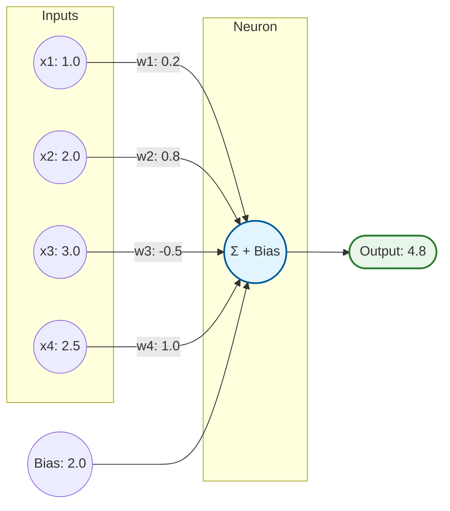
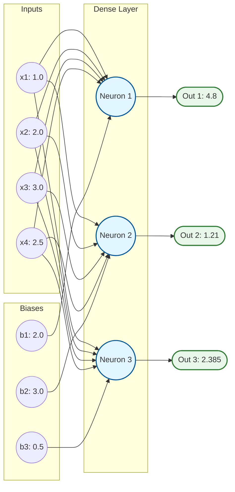
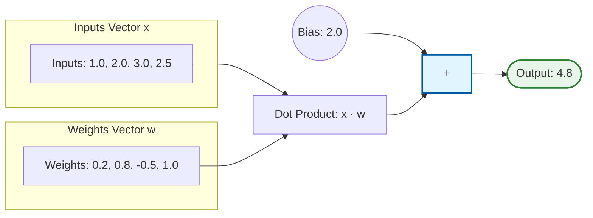
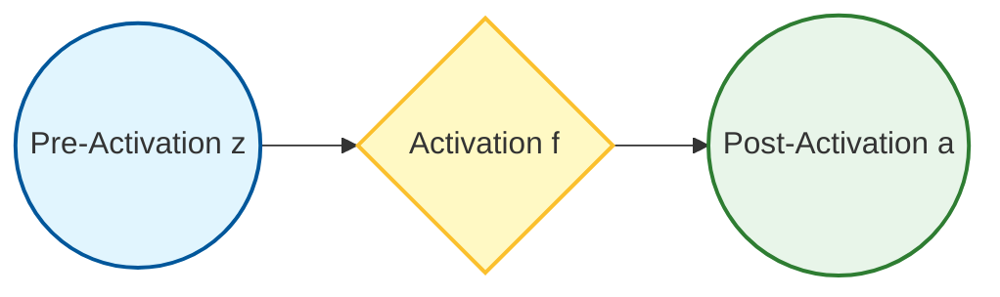

# Neural Network from Scratch (in Python)

Welcome to the **Neural Network from Scratch** repository! This project serves as a step-by-step educational guide to understanding the mathematical and structural foundations of deep learning. By building a neural network from first principles, this codebase transitions gradually from basic loops and manual scalar arithmetic to matrix operations, batch processing, and object-oriented abstractions using NumPy.

Each script inside the [prototype](file:///c:/Users/User/OneDrive/Desktop/Neural_Network_from_Scratch/prototype) directory represents a different "level" in this journey.

---

## 📂 Repository Structure

The project is organized progressively as follows:

```text
Neural_Network_from_Scratch/
│
└── prototype/
    ├── neuron1.py         # Level 1: Single neuron forward pass using manual loops
    ├── neuronLVL2.py      # Level 2: A single layer of 3 neurons with manual calculations
    ├── neuronLVL3.py      # Level 3: Single neuron using NumPy dot product
    ├── neuronLVL4.py      # Level 4: Layer of 3 neurons (single sample) using NumPy dot product
    ├── neuronLVL5.py      # Level 5: Layer of 3 neurons (batch of 3 samples) with weight transposition
    ├── layering.py        # Level 6: Two sequential dense layers using manual matrix operations
    ├── layering2.py       # Level 7: Clean Object-Oriented design introducing the Layer_Dense class
    └── activation.py      # Level 8: Placeholder for future activation functions (ReLU, Softmax, etc.)
```

---

## 🧠 Step-by-Step Evolution & Neural Diagrams

### Level 1: The Fundamental Single Neuron
📄 **File:** [neuron1.py](file:///c:/Users/User/OneDrive/Desktop/Neural_Network_from_Scratch/prototype/neuron1.py)

A single neuron takes multiple inputs, multiplies each by a corresponding weight, adds them together, and then adds a bias:

$$y = \sum_{i=1}^{n} (x_i \cdot w_i) + b$$

#### 📊 Architecture Diagram


*   **Key Concept:** Manual iteration over inputs and weights using a `for` loop.
*   **Math in Action:**
    $$\text{sum} = (1 \times 0.2) + (2 \times 0.8) + (3 \times -0.5) + (2.5 \times 1.0) = 2.8$$
    $$\text{output} = 2.8 + 2.0 \ (\text{bias}) = 4.8$$

---

### Level 2: Multi-Neuron Layers (Manual Arithmetic)
📄 **File:** [neuronLVL2.py](file:///c:/Users/User/OneDrive/Desktop/Neural_Network_from_Scratch/prototype/neuronLVL2.py)

To form a fully connected (dense) layer, we combine multiple neurons that all receive the same inputs but have their own distinct weights and biases.

#### 📊 Architecture Diagram


*   **Key Concept:** Coding three neurons manually without helper libraries. Shows why hardcoding calculations becomes unmanageable as networks grow.

---

### Level 3: Leveraging Vector Math (NumPy Dot Product)
📄 **File:** [neuronLVL3.py](file:///c:/Users/User/OneDrive/Desktop/Neural_Network_from_Scratch/prototype/neuronLVL3.py)

Rather than writing manual loops, we express the weighted sum of a neuron as a dot product between the input vector $\vec{x}$ and weight vector $\vec{w}$.

#### 📊 Architecture Diagram
*(Mathematically identical to Level 1, optimized using vector dot products)*


*   **Key Concept:** Introduction of `numpy` for performance and readability.
*   **Math in Action:**
    $$\text{output} = \vec{x} \cdot \vec{w} + b = \text{np.dot(inputs, weights)} + \text{bias}$$

---

### Level 4: A Whole Layer via Matrix Multiplication
📄 **File:** [neuronLVL4.py](file:///c:/Users/User/OneDrive/Desktop/Neural_Network_from_Scratch/prototype/neuronLVL4.py)

Instead of a single weight vector, we group the weights of all neurons in a layer into a 2D weight matrix ($W$). We calculate the entire layer's output using a single matrix-vector multiplication.

#### 📊 Architecture Diagram
*(Mathematically identical to Level 2, optimized using a weight matrix)*
```mermaid
graph LR
    subgraph Input Vector x
        X[Inputs: [1.0, 2.0, 3.0, 2.5]]
    end
    subgraph Weights Matrix W
        W_Mat["W = [ [w1.1, w1.2, w1.3, w1.4], <br> [w2.1, w2.2, w2.3, w2.4], <br> [w3.1, w3.2, w3.3, w3.4] ]"]
    end
    X & W_Mat --> Dot["Matrix Mult: W · x"]
    Biases["Biases: [2.0, 3.0, 0.5]"] --> Add[+]
    Dot --> Add
    Add --> Output(["Outputs: [4.8, 1.21, 2.385]"])
    
    style Add fill:#e1f5fe,stroke:#01579b,stroke-width:2px;
    style Output fill:#e8f5e9,stroke:#2e7d32,stroke-width:2px;
```

*   **Key Concept:** `np.dot(weights, inputs)` maps multiple weight vectors against a single input vector.

---

### Level 5: Batching Inputs & Transposition
📄 **File:** [neuronLVL5.py](file:///c:/Users/User/OneDrive/Desktop/Neural_Network_from_Scratch/prototype/neuronLVL5.py)

In practice, neural networks process multiple samples at once (a "batch") to leverage GPU/CPU parallelism. Inputs become a 2D matrix ($X$) where rows represent samples and columns represent features.

#### 📊 Architecture Diagram
```mermaid
graph LR
    subgraph Inputs Matrix X (3x4)
        direction TB
        S1["Sample 1: [1.0, 2.0, 3.0, 2.5]"]
        S2["Sample 2: [2.0, 5.0, -1.0, 2.0]"]
        S3["Sample 3: [-1.5, 2.7, 3.3, -0.8]"]
    end

    subgraph Matrix Multiply & Transpose
        direction TB
        Dot["X (3x4) ⊙ W.T (4x3)"]
    end

    subgraph Biases Broadcasting
        B["Biases: [2.0, 3.0, 0.5] (1x3)"]
    end

    subgraph Outputs Matrix (3x3)
        direction TB
        O1["[4.8,  1.21,  2.385] (Sample 1 Out)"]
        O2["[3.2, -0.7,   0.91]  (Sample 2 Out)"]
        O3["[0.16, 5.405, 0.509] (Sample 3 Out)"]
    end

    Inputs_Matrix_X --> Dot
    Biases_Broadcasting --> Dot
    Dot --> Outputs_Matrix
```

*   **Key Concept:** Transposing the weight matrix ($W^T$) to perform matrix multiplication:
    $$\text{Outputs} = X \cdot W^T + B$$
*   **NumPy Broadcasting:** Explains how a 1D bias vector is automatically added to each row of the resulting matrix.

---

### Level 6: Building a Multi-Layer Network
📄 **File:** [layering.py](file:///c:/Users/User/OneDrive/Desktop/Neural_Network_from_Scratch/prototype/layering.py)

Here, we chain two dense layers together. The outputs of the first layer become the inputs to the second layer.

#### 📊 Architecture Diagram
```mermaid
graph LR
    subgraph Inputs X (3x4)
        direction TB
        X_in["3 Batch Samples <br> (4 Features each)"]
    end

    subgraph Layer 1 (Dense)
        direction TB
        L1N1((Neuron 1.1))
        L1N2((Neuron 1.2))
        L1N3((Neuron 1.3))
    end

    subgraph Layer 2 (Dense)
        direction TB
        L2N1((Neuron 2.1))
        L2N2((Neuron 2.2))
        L2N3((Neuron 2.3))
    end

    X_in --> L1N1 & L1N2 & L1N3
    L1N1 & L1N2 & L1N3 --> L2N1 & L2N2 & L2N3

    L2N1 --> Out1([Out Sample 1])
    L2N2 --> Out2([Out Sample 2])
    L2N3 --> Out3([Out Sample 3])

    style L1N1 fill:#e1f5fe,stroke:#01579b,stroke-width:2px;
    style L1N2 fill:#e1f5fe,stroke:#01579b,stroke-width:2px;
    style L1N3 fill:#e1f5fe,stroke:#01579b,stroke-width:2px;
    style L2N1 fill:#f5f5f5,stroke:#616161,stroke-width:2px;
    style L2N2 fill:#f5f5f5,stroke:#616161,stroke-width:2px;
    style L2N3 fill:#f5f5f5,stroke:#616161,stroke-width:2px;
    style Out1 fill:#e8f5e9,stroke:#2e7d32,stroke-width:2px;
    style Out2 fill:#e8f5e9,stroke:#2e7d32,stroke-width:2px;
    style Out3 fill:#e8f5e9,stroke:#2e7d32,stroke-width:2px;
```

*   **Key Concept:** Feeding layer outputs sequentially to create hierarchical representations:
    $$\text{Output}_1 = X \cdot W_1^T + B_1$$
    $$\text{Output}_2 = \text{Output}_1 \cdot W_2^T + B_2$$

---

### Level 7: Clean Object-Oriented Abstraction
📄 **File:** [layering2.py](file:///c:/Users/User/OneDrive/Desktop/Neural_Network_from_Scratch/prototype/layering2.py)

Instead of manually managing matrices for every layer, we encapsulate the logic inside a reusable [Layer_Dense](file:///c:/Users/User/OneDrive/Desktop/Neural_Network_from_Scratch/prototype/layering2.py#L12) class.

#### 📊 Architecture Diagram
```mermaid
graph LR
    subgraph Inputs X (3x4)
        direction TB
        X_in["Features: [f1, f2, f3, f4]"]
    end

    subgraph Layer 1: Dense (4 -> 5)
        direction TB
        H1((H1))
        H2((H2))
        H3((H3))
        H4((H4))
        H5((H5))
    end

    subgraph Layer 2: Dense (5 -> 2)
        direction TB
        O1((O1))
        O2((O2))
    end

    X_in --> H1 & H2 & H3 & H4 & H5
    H1 & H2 & H3 & H4 & H5 --> O1 & O2

    O1 & O2 --> Outputs["Final Output (3x2)"]

    style H1 fill:#e1f5fe,stroke:#01579b,stroke-width:2px;
    style H2 fill:#e1f5fe,stroke:#01579b,stroke-width:2px;
    style H3 fill:#e1f5fe,stroke:#01579b,stroke-width:2px;
    style H4 fill:#e1f5fe,stroke:#01579b,stroke-width:2px;
    style H5 fill:#e1f5fe,stroke:#01579b,stroke-width:2px;
    style O1 fill:#f5f5f5,stroke:#616161,stroke-width:2px;
    style O2 fill:#f5f5f5,stroke:#616161,stroke-width:2px;
    style Outputs fill:#e8f5e9,stroke:#2e7d32,stroke-width:2px;
```

*   **Key Concept:** Object-oriented modularity.
*   **Optimization:** Weights are initialized with shape `(n_inputs, n_neurons)` instead of `(n_neurons, n_inputs)`. This eliminates the need for transposing the weights during the forward pass:
    $$\text{Output} = X \cdot W + B$$
*   **Weight Initialization:** Weights are initialized randomly using Gaussian distribution scaled by `0.10` (`0.10 * np.random.randn(...)`), and biases are initialized to zeros.

---

### Level 8: Activations (Placeholder)
📄 **File:** [activation.py](file:///c:/Users/User/OneDrive/Desktop/Neural_Network_from_Scratch/prototype/activation.py)

A blank slate representing the logical next step: introducing non-linear activation functions (like Rectified Linear Unit (ReLU) or Softmax) to allow the network to learn complex non-linear boundaries.

#### 📊 Concept Diagram


---

## 🚀 Getting Started

### Prerequisites

You need Python 3 and NumPy installed. If you don't have NumPy, install it via pip:

```bash
pip install numpy
```

### Running the Code

You can run any level to see its output in the console. For example, to run the Object-Oriented double-layer neural network forward pass:

```bash
python prototype/layering2.py
```

---

## 🛠️ Future Roadmap

If you wish to expand this project, the logical steps forward are:
1.  **Implement Activation Functions:** Add a `ReLU` class and a `Softmax` class in [activation.py](file:///c:/Users/User/OneDrive/Desktop/Neural_Network_from_Scratch/prototype/activation.py).
2.  **Calculate Loss:** Add loss functions (e.g., Categorical Cross-Entropy) to evaluate model performance.
3.  **Backpropagation:** Implement the chain rule backward pass to calculate gradients of the loss with respect to weights and biases.
4.  **Optimizer:** Implement Stochastic Gradient Descent (SGD) or Adam to update weights and biases.
